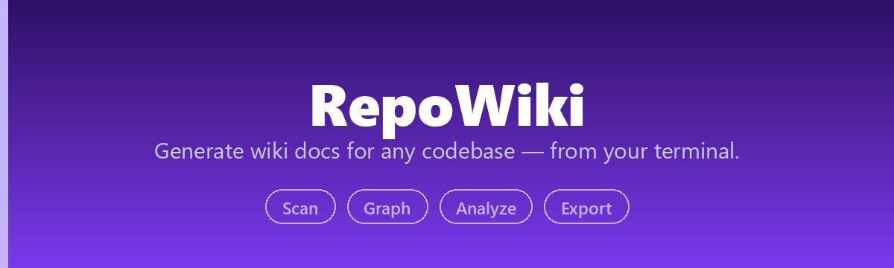
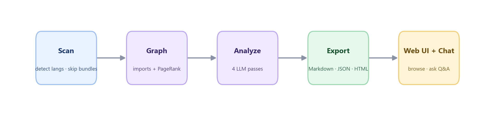

<div align="center">



[](https://pypi.org/project/repowiki/)
[](https://pypi.org/project/repowiki/)
[](LICENSE)
[](https://github.com/he-yufeng/RepoWiki/actions/workflows/ci.yml)

[**Quick Start**](#quick-start) · [**How It Works**](#how-it-works) · [**Why RepoWiki?**](#why-repowiki) · [中文](README_CN.md)

</div>

**Open-source DeepWiki alternative** — generate comprehensive wiki documentation for any codebase from your terminal or browser.

## Why RepoWiki?

| | DeepWiki | deepwiki-open | **RepoWiki** |
|---|---------|--------------|-------------|
| Deploy | SaaS only | Docker Compose | **`pip install repowiki`** |
| Local repos | No | No | **Yes** |
| CLI | No | No | **Yes** |
| Web UI | Yes | Yes | **Yes** |
| Export | Web only | Web only | **Markdown / JSON / HTML** |
| Reading guide | No | No | **PageRank + guided path** |
| Terminal Q&A | No | No | **`repowiki chat`** |
| Dependencies | N/A | Docker + PostgreSQL | **Python + SQLite** |

## Quick Start

```bash
pip install repowiki

# set your API key (DeepSeek, OpenAI, Anthropic, etc.)
export DEEPSEEK_API_KEY=<your-api-key>
# or
repowiki config set api_key <your-api-key>

# scan a local project
repowiki scan ./my-project

# scan a GitHub repo
repowiki scan https://github.com/pallets/flask

# generate self-contained HTML
repowiki scan ./my-project --format html --open

# start the web interface
pip install repowiki[web]
repowiki serve
```

RepoWiki respects `.gitignore` and `.repowikiignore` during scans. It also skips common local secret files such as `.env`, `.env.local`, `.npmrc`, `.pypirc`, and SSH private keys by default.

## Features

### Wiki Generation
Automatically generates structured documentation for any codebase:
- **Project overview** — what it does, tech stack, setup instructions
- **Module documentation** — purpose, key files, relationships, important functions
- **Architecture diagrams** — auto-detected architecture type with Mermaid visualizations
- **Reading guide** — "start here" path based on PageRank file importance ranking
- **Import-aware dependency map** — resolves Python package-relative imports and
  JavaScript/TypeScript relative modules before ranking files
- **Bundle-aware scanner** — skips minified JS/CSS and generated frontend chunks before they burn LLM context

### Multiple Output Formats
- **Markdown** — directory of `.md` files, ready to commit to your repo
- **JSON** — structured data for API consumption or custom rendering
- **HTML** — self-contained single file, share with anyone (Mermaid diagrams included)

### Web Interface
Three-column wiki viewer with sidebar navigation, Mermaid diagram rendering, and an AI-powered Q&A chat about the codebase.

### Terminal Chat
`repowiki chat .` opens an interactive Q&A in the terminal. It indexes the repo with built-in TF-IDF retrieval (no embeddings service, no extra dependencies), pulls the most relevant code for each question, and answers grounded in the actual files — citing paths and line ranges.

### CLI-First Design
Everything works from the terminal. No Docker, no database server, no web browser required.

```bash
repowiki scan .                    # generate wiki
repowiki scan . -f html --open     # open in browser
repowiki scan . -l zh              # Chinese output
repowiki chat .                    # ask questions about the code (interactive)
repowiki config list               # show configuration
```

## Supported Languages

Python, JavaScript, TypeScript, Go, Rust, Java, Kotlin, C/C++, C#, Ruby, PHP, Swift, Dart, Vue, Svelte, and 30+ more.

## Supported LLM Providers

Powered by [litellm](https://github.com/BerriAI/litellm), RepoWiki works with 100+ LLM providers:

| Provider | Model | Alias |
|----------|-------|-------|
| Anthropic | Claude Opus 4.6 | `opus` |
| Anthropic | Claude Sonnet 4.6 | `claude` |
| OpenAI | GPT-5.4 | `gpt` |
| OpenAI | GPT-5.4 Mini | `gpt-mini` |
| Google | Gemini 3.1 Pro | `gemini` |
| Google | Gemini 2.5 Flash | `gemini-flash` |
| DeepSeek | DeepSeek V3.2 | `deepseek` |
| Alibaba | Qwen3.5 Plus | `qwen` |
| Moonshot | Kimi K2.6 | `kimi` |
| Zhipu | GLM-5 | `glm` |
| MiniMax | M2.7 | `minimax` |

```bash
repowiki config set model deepseek    # use alias
repowiki scan . -m gpt                # or pass directly
```

## Configuration

RepoWiki looks for config in this order:
1. CLI flags (`-m`, `-l`, `-o`)
2. Environment variables (`REPOWIKI_MODEL`, `REPOWIKI_API_KEY`)
3. Config file (`~/.repowiki/config.json`)
4. Provider-specific env vars (`DEEPSEEK_API_KEY`, `OPENAI_API_KEY`, `ANTHROPIC_API_KEY`)

## Project Structure

```
RepoWiki/
├── src/repowiki/
│   ├── cli.py              # Click CLI with scan/serve/chat/config commands
│   ├── config.py           # Configuration management
│   ├── core/
│   │   ├── scanner.py      # File scanning with language detection
│   │   ├── analyzer.py     # Multi-step LLM analysis pipeline
│   │   ├── graph.py        # Dependency graph + PageRank
│   │   ├── wiki_builder.py # Wiki page assembly
│   │   ├── rag.py          # TF-IDF retrieval for Q&A
│   │   └── cache.py        # SQLite caching
│   ├── llm/
│   │   ├── client.py       # litellm async wrapper
│   │   └── prompts.py      # Structured prompt templates
│   ├── ingest/
│   │   ├── local.py        # Local directory ingestion
│   │   └── github.py       # Git clone with caching
│   ├── export/
│   │   ├── markdown.py     # Markdown directory export
│   │   ├── json_export.py  # JSON export
│   │   └── html.py         # Self-contained HTML export
│   └── server/             # FastAPI web backend
├── frontend/               # React + Vite + TailwindCSS
├── pyproject.toml
└── LICENSE
```

## How It Works



1. **Scan** — Walk the directory tree, filter out binaries, generated bundles, and oversized files, detect languages and entry points
2. **Graph** — Resolve imports across 6 languages, including Python package-relative and
   JavaScript/TypeScript relative modules, then run PageRank to rank file importance
3. **Analyze** — Send file tree + key files to LLM in 4 structured passes (overview, modules, architecture, reading guide)
4. **Cache** — Store results in SQLite keyed by content hash, skip unchanged files on re-scan
5. **Export** — Assemble wiki pages with Mermaid diagrams and source links, output in chosen format

## Development

```bash
git clone https://github.com/he-yufeng/RepoWiki.git
cd RepoWiki

# backend
python -m venv .venv && source .venv/bin/activate
pip install -e ".[dev,web]"

# frontend
cd frontend && npm install && npm run dev

# run backend
repowiki serve --port 8000
```

## Roadmap

Generation, the web interface, and the diagrams work. The next steps are about keeping a wiki fresh and better connected:

- **Incremental re-generation** — regenerate only the pages whose source changed since the last run, so updating a wiki on a large repo isn't a full rebuild every time.
- **Cross-reference links** — link a symbol mentioned on one module page to the page where it's defined, so the wiki reads like connected docs instead of isolated pages.
- **More diagram types** — a call graph and a data-flow view alongside the dependency graph, since the analysis already walks imports and could surface more.
- **Publish to a static site** — a one-command export to a GitHub Pages-ready site, so a generated wiki can live as a project's docs, not just a local file.

## Related Projects

If RepoWiki helped you find your way around a codebase, a few other things I've built:

- [**CoreCoder**](https://github.com/he-yufeng/CoreCoder) — want to understand how a coding agent really works? Read the whole ~1k-line engine end to end, not a black box.
- [**FindJobs-Agent**](https://github.com/he-yufeng/FindJobs-Agent) — stop sifting job boards by hand: it ranks postings against your resume and runs mock interviews.
- [**ContractGuard**](https://github.com/he-yufeng/ContractGuard) — catch the risky clauses before you sign: it reads contracts and flags the dangerous bits.
- [**GitSense**](https://github.com/he-yufeng/GitSense) — want to contribute to open source? It finds issues worth your time and gauges whether your PR will get merged.
- [**CodeABC**](https://github.com/he-yufeng/CodeABC) — understand any codebase even if you don't code, built for non-programmers.

## License

MIT
