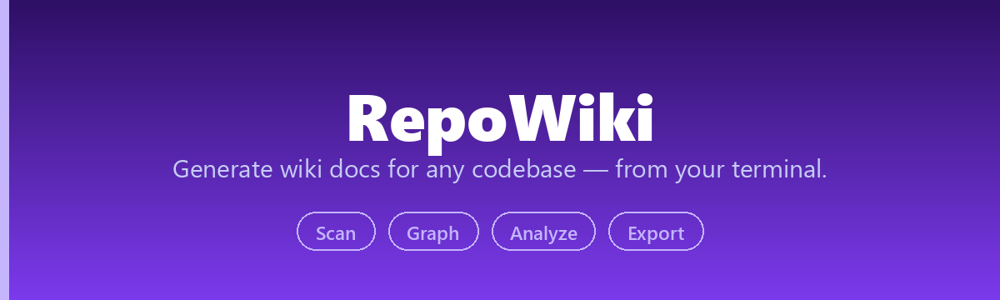
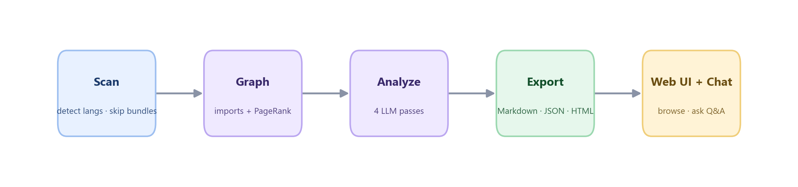

<div align="center">



[](https://pypi.org/project/repowiki/)
[](https://pypi.org/project/repowiki/)
[](LICENSE)
[](https://github.com/he-yufeng/RepoWiki/actions/workflows/ci.yml)

[**快速开始**](#快速开始) · [**工作原理**](#工作原理) · [English](README.md)

</div>

**开源 DeepWiki 替代品** — 从终端或浏览器为任意代码仓库生成完整 wiki 文档。

## 为什么选 RepoWiki？

| | DeepWiki | deepwiki-open | **RepoWiki** |
|---|---------|--------------|-------------|
| 部署方式 | SaaS，不可自托管 | Docker Compose | **`pip install repowiki`** |
| 本地仓库 | 不支持 | 不支持 | **原生支持** |
| CLI | 无 | 无 | **有** |
| Web UI | 有 | 有 | **有** |
| 导出格式 | 仅网页 | 仅网页 | **Markdown / JSON / HTML** |
| 阅读指南 | 无 | 无 | **PageRank 排名 + 阅读路径** |
| 终端问答 | 无 | 无 | **`repowiki chat`** |
| 依赖 | N/A | Docker + PostgreSQL | **Python + SQLite** |

## 快速开始

```bash
pip install repowiki

# 设置 API Key（DeepSeek、OpenAI、Anthropic 等）
export DEEPSEEK_API_KEY=<your-api-key>
# 或者
repowiki config set api_key <your-api-key>

# 扫描本地项目
repowiki scan ./my-project

# 扫描 GitHub 仓库
repowiki scan https://github.com/pallets/flask

# 扫描私有 GitHub 仓库（token 不会落进日志或报错）
GITHUB_TOKEN=ghp_xxx repowiki scan https://github.com/acme/private-repo

# 生成自包含 HTML 并打开
repowiki scan ./my-project --format html --open

# 启动 Web 界面（PyPI 安装包自带构建好的前端）
pip install repowiki[web]
repowiki serve ./my-project   # 可选：启动时直接加载一个项目
```

扫描时会遵守 `.gitignore` 和 `.repowikiignore`，并默认跳过 `.env`、`.env.local`、`.npmrc`、`.pypirc`、SSH 私钥等本地敏感文件，避免把不该进入文档上下文的内容喂给后续分析。

## 核心功能

- **结构化 wiki** — 项目概览、逐模块文档、自动识别的架构（含 Mermaid 图），以及基于 PageRank 的"从这里开始读"路径。
- **页面交叉链接**：页面里反引号包住的符号名或文件路径，如果正好对应另一个 wiki 页面，就会自动变成指向那一页的链接（Markdown 里是相对 .md 链接，HTML 导出里是页内跳转）。围栏代码块原样保留；同一个名字被多个页面定义时，链到第一个页面。
- **全局符号索引**：索引页汇总分析记录的所有关键符号，先按类别（class、function 等）分组，组内再按模块归类，每个符号都链回所属模块页；没有记录符号的项目不生成该页。
- **增量重跑**：输出目录里的 `.repowiki-state.json` 记录每个页面由哪些输入生成，再次扫描只重新生成源码有变化的页面，并清理被删模块对应的页面；JSON 和 HTML 导出在内容没有变化时直接不写盘。加 `--full` 可强制全量重建。
- **import 感知排名** — 先解析 Python 和 JS/TS 的 import 再排名，并跳过 minified/生成式 bundle，避免浪费 LLM 上下文。
- **三种导出格式** — 可直接提交的 Markdown 目录、结构化 JSON，或自包含、随手能分享的 HTML 单文件（含图表）。
- **静态站点发布**：`repowiki scan . --site` 会在 Markdown 导出目录里生成 docsify 加载页（`index.html` 和 `.nojekyll`），把目录推到 GitHub Pages 上就是一个能直接浏览的文档站。
- **Web 查看器 + 终端问答** — 三栏浏览器界面，或 `repowiki chat .` 在终端里做基于源码的问答（内置 TF-IDF 检索，无需 embedding 服务）。
- **CLI 优先** — 不需要 Docker、数据库或浏览器。

```bash
repowiki scan .                    # 生成 wiki
repowiki scan . --full             # 忽略增量状态，全量重建每个页面
repowiki scan . -f html --open     # 浏览器打开
repowiki scan . -l zh              # 中文输出
repowiki chat .                    # 终端里就代码问答
repowiki map .                     # 按真实依赖排序的仓库地图，零 LLM 调用
repowiki map . --format json       # 给 agent 用的可入 prompt 排序清单
repowiki scan . --site             # 在 Markdown 导出基础上生成 GitHub Pages 加载页
```

## 语言与模型

识别 Python、JavaScript、TypeScript、Go、Rust、Java、Kotlin、C/C++、C#、Ruby、PHP、Swift 等 30+ 种语言。litellm 的 100+ 提供商都能用，用别名选一个，或直接传模型名：

```bash
repowiki config set model deepseek   # deepseek / claude / gpt / gemini / qwen / kimi / glm ...
repowiki scan . -m gpt               # 或直接传模型名
```

## 配置

RepoWiki 按以下顺序查找配置：
1. 命令行参数（`-m`、`-l`、`-o`）
2. 环境变量（`REPOWIKI_MODEL`、`REPOWIKI_API_KEY`）
3. 配置文件（`~/.repowiki/config.json`）
4. 各提供商专用环境变量（`DEEPSEEK_API_KEY`、`OPENAI_API_KEY`、`ANTHROPIC_API_KEY`）

私有 GitHub 仓库用 `GITHUB_TOKEN`（或 `GH_TOKEN`）：clone 走认证连接，token 只出现在 git 调用内部，不落日志、不进报错。

## 项目结构

```
RepoWiki/
├── src/repowiki/
│   ├── cli.py              # Click CLI，含 scan/serve/chat/config 命令
│   ├── config.py           # 配置管理
│   ├── core/
│   │   ├── scanner.py      # 文件扫描 + 语言识别
│   │   ├── analyzer.py     # 多步 LLM 分析流水线
│   │   ├── graph.py        # 依赖图 + PageRank
│   │   ├── wiki_builder.py # Wiki 页面组装
│   │   ├── rag.py          # 面向问答的 TF-IDF 检索
│   │   ├── cache.py        # SQLite 缓存
│   │   └── state.py        # 增量重生成状态
│   ├── llm/
│   │   ├── client.py       # litellm 异步封装
│   │   └── prompts.py      # 结构化 prompt 模板
│   ├── ingest/
│   │   ├── local.py        # 本地目录导入
│   │   └── github.py       # 带缓存的 git clone
│   ├── export/
│   │   ├── markdown.py     # Markdown 目录导出
│   │   ├── json_export.py  # JSON 导出
│   │   └── html.py         # 自包含 HTML 导出
│   └── server/             # FastAPI web 后端
├── frontend/               # React + Vite + TailwindCSS
├── pyproject.toml
└── LICENSE
```

## 工作原理



1. **扫描** — 遍历目录树，过滤二进制、生成式 bundle 和超大文件，检测语言和入口文件
2. **建图** — 解析 6 种语言的 import，正确处理 Python 包内相对导入和
   JavaScript / TypeScript 相对模块，再用 PageRank 计算文件重要性
3. **分析** — 4 步 LLM 分析（概览、模块、架构、阅读指南），并发执行
4. **缓存** — SQLite 按内容 hash 缓存，重新扫描时跳过未变更文件
5. **导出** — 组装 wiki 页面，注入 Mermaid 图和源码链接，按选定格式输出

## 开发

```bash
git clone https://github.com/he-yufeng/RepoWiki.git
cd RepoWiki

# 后端
python -m venv .venv && source .venv/bin/activate
pip install -e ".[dev,web]"

# 前端
cd frontend && npm install && npm run dev

# 启动后端
repowiki serve --port 8000
```

## 后续规划

生成、Web 界面、图表这几块已经能用，页面之间互相链接，重跑只重新生成源码有变化的页面，`scan --site` 还能一键导出可直接部署 GitHub Pages 的静态站点。接下来主要是更丰富的图表：

- **更多图表类型**：在依赖图之外再加调用图和数据流图——分析本来就走了 import，能挖出更多。

## 相关项目

如果 RepoWiki 帮你摸清了一个代码库，下面几个我做的东西也许你会喜欢：

- [**CoreCoder**](https://github.com/he-yufeng/CoreCoder) — 想搞懂一个 coding agent 到底怎么运作？把整套约 1000 行引擎从头读到尾，而不是当黑箱。
- [**FindJobs-Agent**](https://github.com/he-yufeng/FindJobs-Agent) — 别再手动刷招聘网站：它按你的简历给岗位排序，还能跑模拟面试。
- [**ContractGuard**](https://github.com/he-yufeng/ContractGuard) — 签字前先把有风险的条款挑出来：它读合同、标出危险点。
- [**GitSense**](https://github.com/he-yufeng/GitSense) — 想给开源做贡献？它帮你找到值得做的 issue，还能估你的 PR 多大概率被合。
- [**CodeABC**](https://github.com/he-yufeng/CodeABC) — 不会写代码也能看懂一个项目，专给小白做的。

## 许可证

MIT
