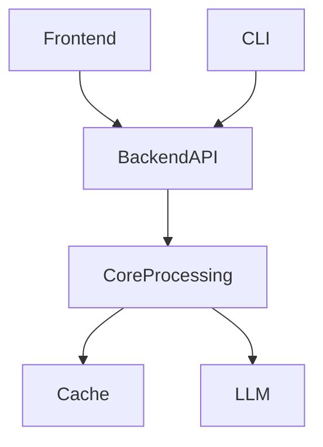
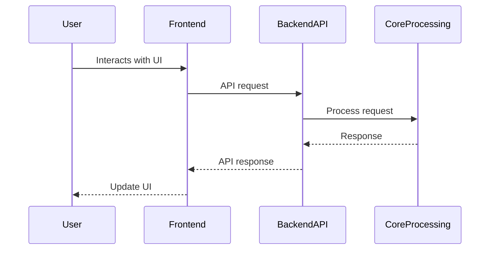

# Architecture

**Type:** client-server

RepoWiki follows a client-server architecture with a Python backend (FastAPI) serving a React frontend. The backend handles code analysis, wiki generation, and chat functionality, while the frontend provides a web interface for viewing and interacting with the generated documentation.

## Component Diagram

## Components

### Frontend

Provides web interface for viewing and interacting with generated wikis

Files: `frontend/src/App.tsx`, `frontend/src/pages/*`, `frontend/src/components/*`

### Backend API

Handles code analysis, wiki generation, and chat functionality

Files: `src/repowiki/server/app.py`, `src/repowiki/server/routers/*`

### Core Processing

Performs code analysis and wiki generation

Files: `src/repowiki/core/*`

### CLI

Provides command-line interface for scanning and generating wikis

Files: `src/repowiki/cli.py`, `src/repowiki/__main__.py`

## Sequence Diagram

## Data Flow

The main data flow starts with the user interacting with the frontend, which makes API calls to the backend. The backend processes these requests using core analysis components, potentially calling LLM services, and returns structured data that the frontend renders. For CLI usage, commands directly invoke backend functionality to generate documentation.
