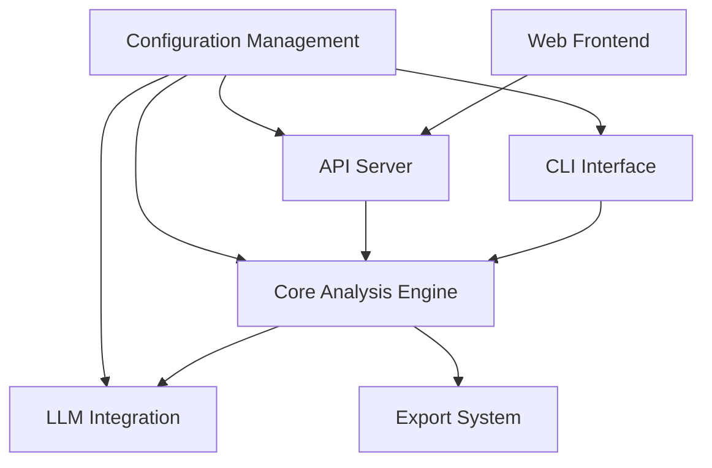
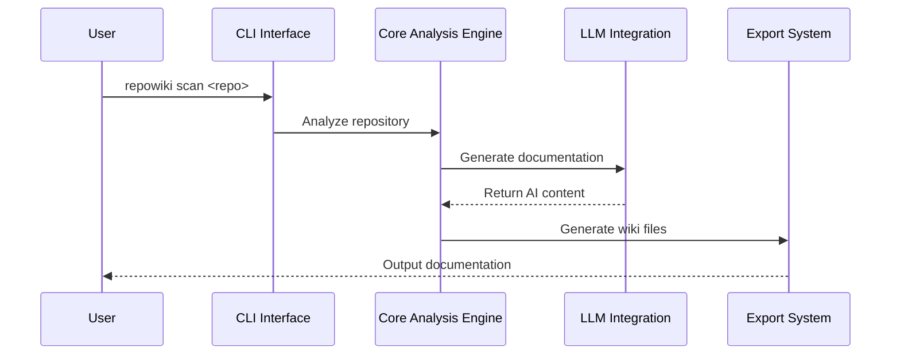

# Architecture

**Type:** client-server

RepoWiki follows a client-server architecture with a Python backend that provides code analysis and wiki generation services, and a React frontend that offers a web interface. The backend uses FastAPI to serve REST APIs for scanning repositories, generating documentation, and providing chat functionality. The system can also run as a CLI tool for local repository analysis without the web interface.

## Component Diagram

```mermaid
graph TD
    A[CLI Interface] --> B[Core Analysis Engine]
    B --> C[LLM Integration]
    B --> D[Export System]
    E[Web Frontend] --> F[API Server]
    F --> B
    G[Configuration Management] --> A
    G --> B
    G --> C
    G --> F
```

## Components

### CLI Interface

Command-line interface for repository scanning and wiki generation

Files: `src/repowiki/cli.py`, `src/repowiki/__main__.py`

### Core Analysis Engine

Code analysis, scanning, and wiki generation logic

Files: `src/repowiki/core/analyzer.py`, `src/repowiki/core/scanner.py`, `src/repowiki/core/wiki_builder.py`

### LLM Integration

Interface with various LLM providers for AI-powered documentation

Files: `src/repowiki/llm/client.py`, `src/repowiki/llm/prompts.py`

### API Server

FastAPI server providing REST endpoints for web interface

Files: `src/repowiki/server/app.py`, `src/repowiki/server/routers/chat.py`, `src/repowiki/server/routers/wiki.py`

### Web Frontend

React-based user interface for browsing generated wikis

Files: `frontend/src/App.tsx`, `frontend/src/pages/WikiView.tsx`, `frontend/src/pages/ChatView.tsx`

### Export System

Generate wiki documentation in multiple formats

Files: `src/repowiki/export/html.py`, `src/repowiki/export/markdown.py`, `src/repowiki/export/site.py`

### Configuration Management

Handle user settings and API configurations

Files: `src/repowiki/config.py`, [`.env.example`](modules/root.md)

## Sequence Diagram

```mermaid
sequenceDiagram
    participant User
    participant CLI as CLI Interface
    participant Core as Core Analysis Engine
    participant LLM as LLM Integration
    participant Export as Export System
    User->>CLI: repowiki scan <repo>
    CLI->>Core: Analyze repository
    Core->>LLM: Generate documentation
    LLM-->>Core: Return AI content
    Core->>Export: Generate wiki files
    Export-->>User: Output documentation
```

## Data Flow

Users interact with RepoWiki either through the CLI or web interface. The system scans repository files, analyzes code structure using LLM-powered analysis, and generates comprehensive wiki documentation. Generated content is cached and can be exported in multiple formats (Markdown, HTML, JSON) or served through the web interface with cross-linked navigation.
