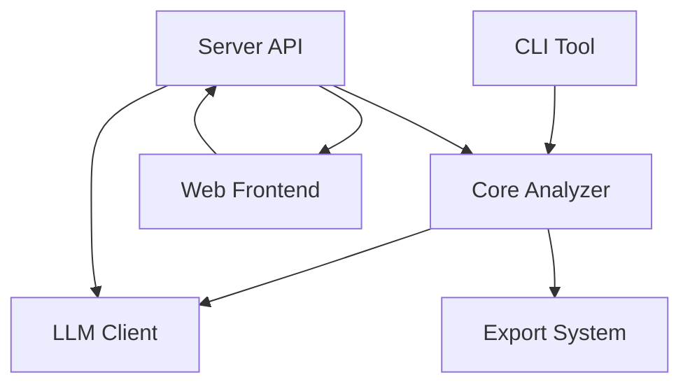
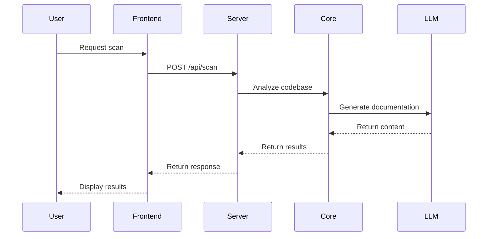

# Architecture

**Type:** client-server

RepoWiki is a client-server application with a Python backend that analyzes codebases and generates documentation, and a React frontend that provides a web interface. The backend uses FastAPI to serve REST APIs for scanning, chatting, and wiki operations, while the frontend consumes these APIs and renders the UI.

## Component Diagram

```mermaid
graph TD
  CLI[CLI Tool] --> Core[Core Analyzer]
  Core --> LLM[LLM Client]
  Core --> Export[Export System]
  Server[Server API] --> Core
  Server --> LLM
  Frontend[Web Frontend] --> Server
  Server --> Frontend
```

## Components

### CLI

Command-line interface for scanning codebases and generating documentation

Files: [`src/repowiki/cli.py`](modules/repowiki.md), [`src/repowiki/__main__.py`](modules/repowiki.md)

### Core Analyzer

Analyzes code structure, extracts symbols, and builds knowledge graph

Files: [`src/repowiki/core/analyzer.py`](modules/repowiki.md), [`src/repowiki/core/scanner.py`](modules/repowiki.md), [`src/repowiki/core/graph.py`](modules/repowiki.md)

### LLM Client

Handles communication with LLM providers for generating documentation

Files: [`src/repowiki/llm/client.py`](modules/repowiki.md), [`src/repowiki/llm/prompts.py`](modules/repowiki.md)

### Server API

FastAPI server providing REST endpoints for web interface

Files: [`src/repowiki/server/app.py`](modules/repowiki.md), [`src/repowiki/server/routers/chat.py`](modules/repowiki.md), [`src/repowiki/server/routers/scan.py`](modules/repowiki.md)

### Frontend

React-based web interface for browsing documentation and chatting

Files: `frontend/src/App.tsx`, `frontend/src/pages/Home.tsx`, `frontend/src/pages/WikiView.tsx`

### Export System

Generates documentation exports in multiple formats (HTML, Markdown, JSON)

Files: [`src/repowiki/export/html.py`](modules/repowiki.md), [`src/repowiki/export/markdown.py`](modules/repowiki.md), [`src/repowiki/export/json_export.py`](modules/repowiki.md)

## Sequence Diagram

```mermaid
sequenceDiagram
  participant User
  participant Frontend
  participant Server
  participant Core
  participant LLM
  User->>Frontend: Request scan
  Frontend->>Server: POST /api/scan
  Server->>Core: Analyze codebase
  Core->>LLM: Generate documentation
  LLM-->>Core: Return content
  Core-->>Server: Return results
  Server-->>Frontend: Return response
  Frontend-->>User: Display results
```

## Data Flow

Users initiate scans through either the CLI or web interface. The backend analyzes the codebase structure, extracts symbols, and uses LLMs to generate documentation content. The results are then served through the web interface or exported to various formats like HTML and Markdown.
