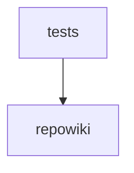

# Module Dependencies

## Core Files (by PageRank)

1. `src/repowiki/core/models.py`
2. `frontend/src/lib/api.ts`
3. `src/repowiki/core/wiki_builder.py`
4. `src/repowiki/core/graph.py`
5. `src/repowiki/core/cache.py`
6. `frontend/src/stores/wiki.ts`
7. `src/repowiki/cli.py`
8. `src/repowiki/core/scanner.py`
9. `src/repowiki/core/rag.py`
10. `src/repowiki/__init__.py`

## Likely Entry Points

- `frontend/src/App.tsx`
- `src/repowiki/__main__.py`
- `frontend/src/components/SettingsModal.tsx`
- `frontend/src/components/WikiContent.tsx`
- `frontend/src/components/WikiSidebar.tsx`
- `frontend/src/main.tsx`
- `frontend/src/pages/ChatView.tsx`
- `frontend/src/pages/Home.tsx`
- `frontend/src/pages/WikiView.tsx`
- `src/repowiki/server/routers/chat.py`

## Circular Dependencies

These groups of files import each other in a cycle, so you can't fully understand one without the others; consider breaking the loop to reduce coupling.

- `src/repowiki/server/app.py`, `src/repowiki/server/routers/scan.py`

## Isolated Files

These files import nothing in the project and are imported by nothing -- likely dead code, stray scripts, or modules that were never wired in.

- [`.env.example`](modules/root.md)
- [`.github/workflows/ci.yml`](modules/.github.md)
- [`.github/workflows/publish.yml`](modules/.github.md)
- [`.gitignore`](modules/root.md)
- [`LICENSE`](modules/root.md)
- [`README.md`](modules/root.md)
- [`README_CN.md`](modules/root.md)
- `frontend/index.html`
- `frontend/package-lock.json`
- `frontend/package.json`
- `frontend/src/index.css`
- `frontend/src/vite-env.d.ts`
- `frontend/tsconfig.json`
- `frontend/vite.config.ts`
- [`pyproject.toml`](modules/root.md)
