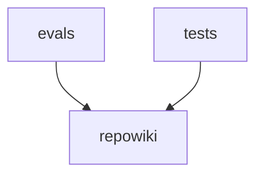

# Module Dependencies

```mermaid
graph TD
  evals[evals] --> repowiki[repowiki]
  tests[tests] --> repowiki[repowiki]
```

## Core Files (by PageRank)

1. [`src/repowiki/core/models.py`](modules/repowiki.md)
2. `frontend/src/lib/api.ts`
3. [`src/repowiki/core/graph.py`](modules/repowiki.md)
4. [`src/repowiki/core/wiki_builder.py`](modules/repowiki.md)
5. [`src/repowiki/core/cache.py`](modules/repowiki.md)
6. `frontend/src/stores/wiki.ts`
7. [`src/repowiki/core/scanner.py`](modules/repowiki.md)
8. [`src/repowiki/cli.py`](modules/repowiki.md)
9. [`src/repowiki/core/rag.py`](modules/repowiki.md)
10. [`src/repowiki/llm/client.py`](modules/repowiki.md)

## Likely Entry Points

- `frontend/src/App.tsx`
- [`src/repowiki/__main__.py`](modules/repowiki.md)
- [`evals/run_eval.py`](modules/evals.md)
- `frontend/src/components/SettingsModal.tsx`
- `frontend/src/components/WikiContent.tsx`
- `frontend/src/components/WikiSidebar.tsx`
- `frontend/src/main.tsx`
- `frontend/src/pages/ChatView.tsx`
- `frontend/src/pages/FileView.tsx`
- `frontend/src/pages/Home.tsx`

## Circular Dependencies

These groups of files import each other in a cycle, so you can't fully understand one without the others; consider breaking the loop to reduce coupling.

- [`src/repowiki/server/app.py`](modules/repowiki.md), [`src/repowiki/server/routers/scan.py`](modules/repowiki.md)

## Isolated Files

These files import nothing in the project and are imported by nothing -- likely dead code, stray scripts, or modules that were never wired in.

- [`.env.example`](modules/root.md)
- [`.github/workflows/ci.yml`](modules/.github.md)
- [`.github/workflows/demo.yml`](modules/.github.md)
- [`.github/workflows/publish.yml`](modules/.github.md)
- [`.gitignore`](modules/root.md)
- [`LICENSE`](modules/root.md)
- [`README.md`](modules/root.md)
- [`README_CN.md`](modules/root.md)
- [`evals/baseline.json`](modules/evals.md)
- [`evals/fixtures/modules/grainpipe.json`](modules/evals.md)
- [`evals/fixtures/modules/relayboard.json`](modules/evals.md)
- [`evals/fixtures/modules/taskvane.json`](modules/evals.md)
- [`evals/fixtures/questions.json`](modules/evals.md)
- `evals/fixtures/repos/grainpipe/README.md`
- `evals/fixtures/repos/grainpipe/examples/orders.yaml`
